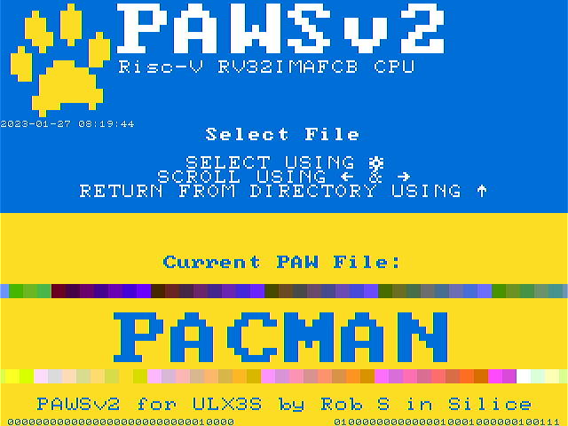
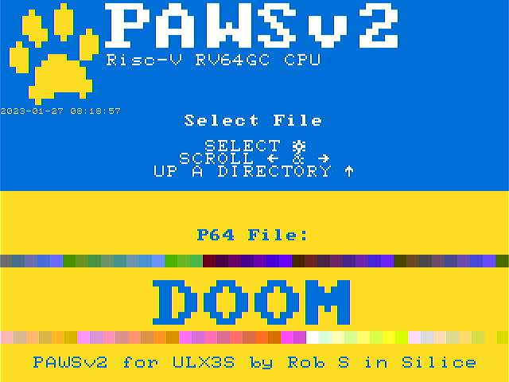

# PAWSv2 a Risc-V ( 32bit RV32IMAFC+B or 64bit RV64GC )

* Written in Silice
    * Inspired by ICE-V by [ICE-V](https://github.com/sylefeb/Silice/tree/master/projects/ice-v) by @sylefeb

Refer to RV32 for the 32bit CPU, or RV64 for the 64bit CPU. Development has stopped on the 32bit CPU, but is kept for reference.

Copy the files from the directory "SOFTWARE/PAWS" to an SDCARD and insert into the ULX3S. Flash the bitstream from "ULX3S/BUILD_ulx3s/PAWSv2-32.bit" or "ULX3S/BUILD_ulx3s/PAWSv2-64.bit" to the ULX3S

32bit software has a .PAW extension. 64bit software has a .P64 extension.

```
fujprog PAWSv2-32.bit
```



```
fujprog PAWSv2-64.bit
```



This will initialise the BIOS and allow the selection of a .PAW or .P64 file to load and run.
