# PAWSv2 a Risc-V ( 32bit RV32IMAFC+B or 64bit RV64GC+B )

* Written in Silice
    * Inspired by ICE-V by [ICE-V](https://github.com/sylefeb/Silice/tree/master/projects/ice-v) by @sylefeb

The aim of PAWS is to have a modern CPU, Risc-V was chosen for ease of implementation, with system capabilities equivalent to an 80s era computer/games console, with as much off-loading to the hardware as possible for speed. A single-precision floating-point unit was eventually added as a challenge to myself, expanded to support double-precision floating-point with the move to the 64-biot RV64 CPU, with the enablement of half-precision in progress (for the recently ratified Risc-V zfh extension).

* Display
    * Multiple display layers
        * Background (solid and various patterns)
        * 2 tilemaps (40x20 visible, 16x16 tiles, 64 available per layer, with scrolling)
        * Text Display (80x60, 8x8 characters, normal and bold fonts)
        * 2 sprite layers (16 16x16 sprites per layer, each sprite can have 8 tiles)
        * 2 320x240 bitmaps, for double buffering or simultaneous display

Refer to RV32 for the 32bit CPU, or RV64 for the 64bit CPU. Development has stopped on the 32bit CPU, but is kept for reference, with backporting where applicable.

Copy the files from the directory "SOFTWARE/PAWS" to an SDCARD and insert into the ULX3S. Flash the bitstream from "ULX3S/BUILD_ulx3s/PAWSv2-32.bit" or "ULX3S/BUILD_ulx3s/PAWSv2-64.bit" to the ULX3S

32bit software has a .PAW extension. 64bit software has a .P64 extension.

<br>
The 32-bit BIOS
<br>

```
fujprog PAWSv2-32.bit
```


<br>
The 64-bit BIOS
<br>

```
fujprog PAWSv2-64.bit
```


This will initialise the BIOS and allow the selection of a .PAW or .P64 file to load and run.

# Example Program Screenshots

## 3DMAZE (GAMES)
Based upon the ZX-81 3D MONSTER MAZE using PacMan Ghosts instead of the dinorsaur, as I don't have graphics for a Tyrannosaurus Rex.
<br>
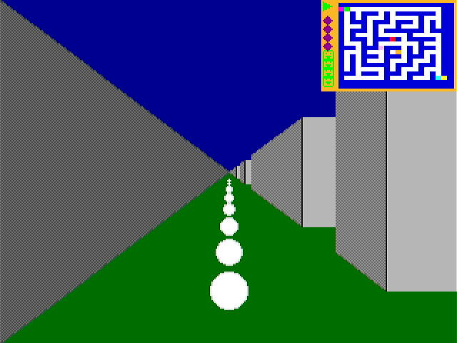

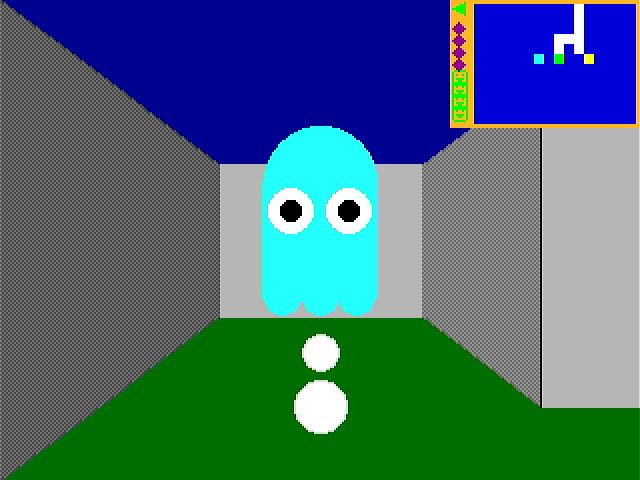

## ANT (DEMO)
A simple test https://en.wikipedia.org/wiki/Langton%27s_ant which I discovered after reading https://en.wikipedia.org/wiki/The_Science_of_Discworld by Terry Pratchett, Ian Stewart and Jack Cohen.
<br>
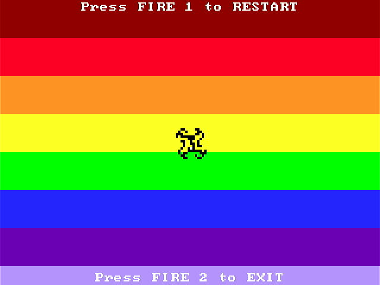

## ASTROIDS (GAMES)
An implementation of the arcade games Asteroids, written from scratch, using the PAWSv2 sprites. The asteroid sprites are moved in the SMT thread.
<br>
When I first started programming for FPGAs, Asteroids was my first game implemented (j1eforth on the DE10-Nano and ULX3S, it probably doesn't build and run now, but I'll update it), and the development of the features for SoC was driven by the requirements for Asteroids, i.e. sprites for the ships, bullets, asteroids and UFOs, initially in single colour, and eventually in 256 colour sprites; input, the FPGA board buttons, and eventually the PS/2 keyboard; simple sound, initially tone generators, expanded to include waveforms, square, triangle, saw and sine, plus eventually user-defined waveforms, simple 1-bit samples, DOOM style PC speaker sounds, which can be used for playing tunes.
<br>
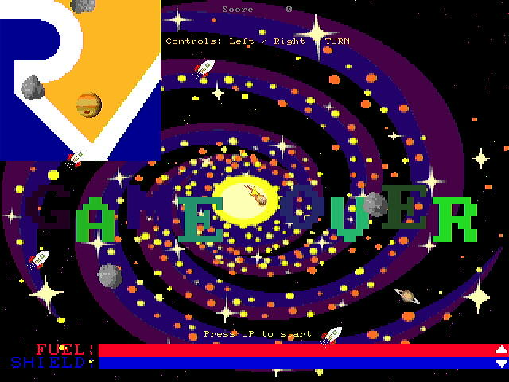
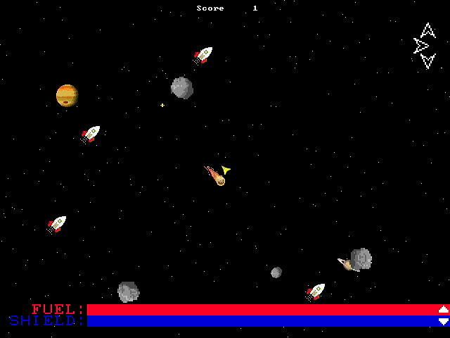

## CHIP-8 (COMPUTER/CHIP-8)
A CHIP-8 interpreter (only for RV64), capable of running CHIP-8, CHIP-48, SUPERCHIP and XO-CHIP programs (with varying success). Runs as 2 threads, 1 for input and display, 1 for the interpreter. This was done not for any particular reason other than to try and have 2 threads interacting. NO MEMORY PROTECTION IN PAWSv2!

Uses 64-bit integers to implement the display, and uses the ROR/ROL instructions for scrolling, and the BINV/BEXT instructions for setting bits in the display, so not presently support on the RV32 CPU.
<br>
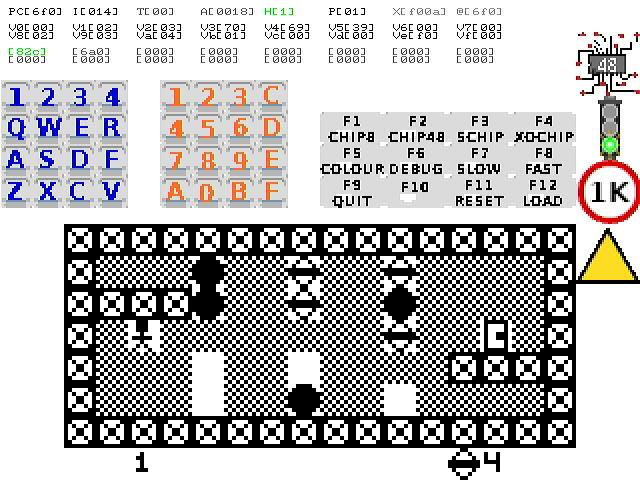
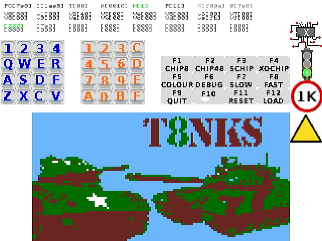
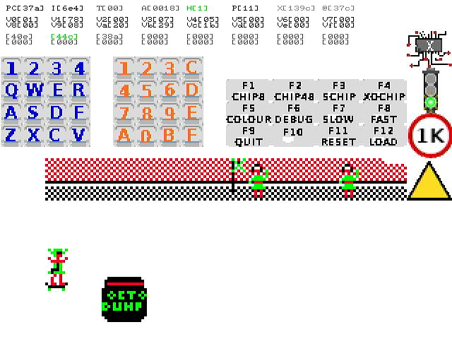

## DOOM (GAMES)
A conversion of https://github.com/mbitsnbites/mc1-doom to the PAWSv2 graphics, sound and input system. The images are drawn to the screen using the DMA engine, with the display being in 256 colour mode, and uses the DOOM palette, no the PAWSv2 default RGBM palette. DOOM style PC speaker sound support was added to PAWSv2 for DOOM.
<br>
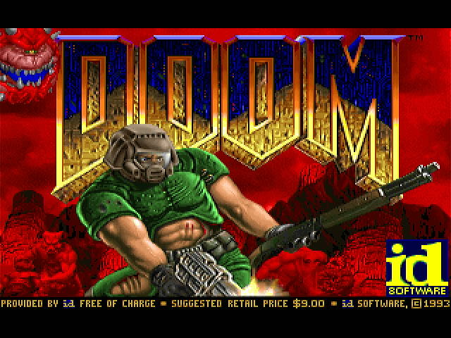
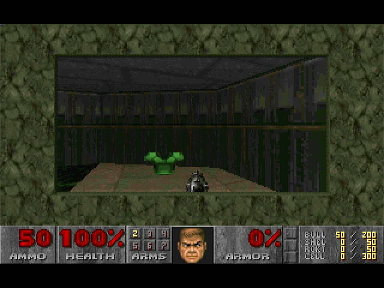

## IMGUI (DEMO)
A test running the IMGUI DEMO to check PAWSv2 against other people's code, specially heavy on the floating-point unit. The generated image is tranferred to the display using the DMA engine, translating the RGBA image to PAWSv2 via the pixelblock. Press FIRE 1 and FIRE 2 buttons simultaneously to exit.
<br>
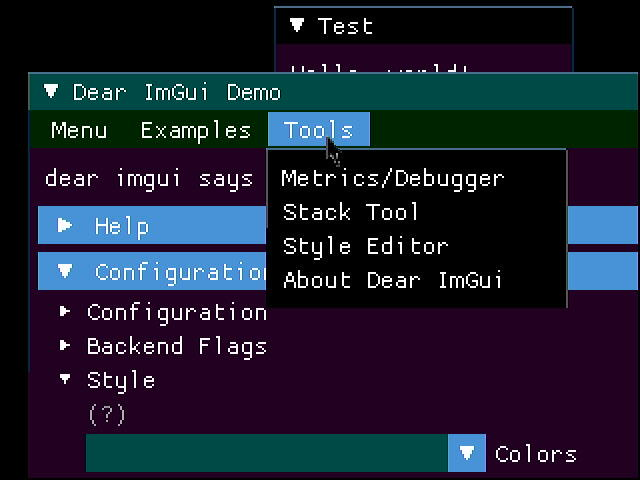

## INVADERS (GAMES)
An implementation of the arcade games Space Invaders. The space invaders, bunkers and UFO are drawn using the blitter. The background images and score are drawm using the two tilemaps. The player ship and the bullets are sprites, using the sprite to background detection. Written after reading http://nicktasios.nl/posts/space-invaders-from-scratch-part-1.html
<br>
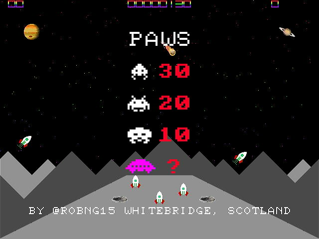
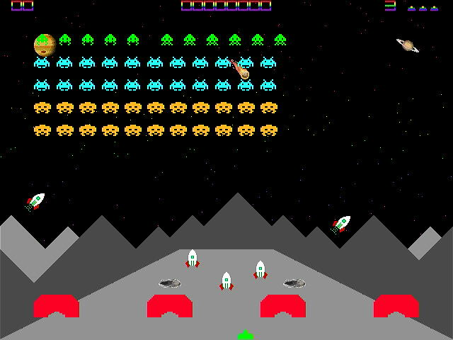

## JPEG (DEMO)
A simple test of the pixelblock (hardware transfer from memory to the display), in this case remapping RGB data in the PAWSv2 RGBM (256 colour) display, and the 256 greyscale display. Also tests the file selector, based upon the BIOS file selector. NOTE: The JPEG decoder is only tested with 320x240 pixel images, and they must be non-progressive, and colour.

The image displayed below, shows our PAWS, for whom the project is named. From left to right, Rydie, the brains of the outfit, Arrow, the beeps and squeaks (the noise he makes), and Dougie (our rescue dog and my walking companion) the graphical display as he is always in your face!
<br>
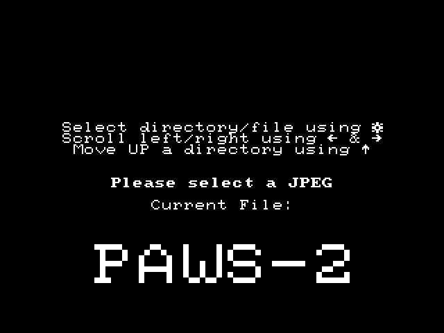
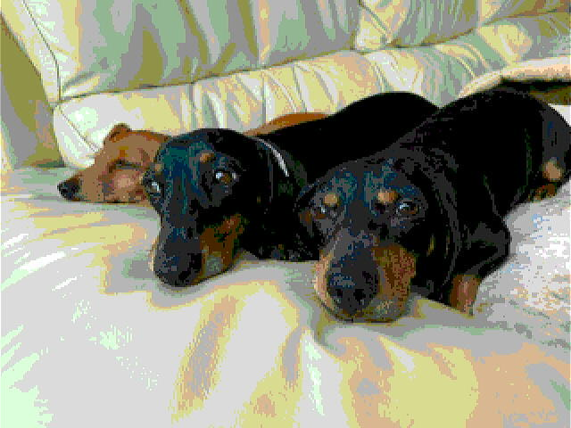
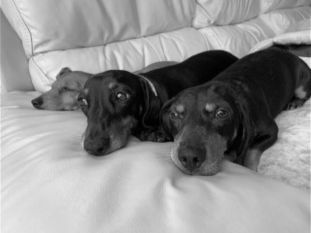


## OUTRUN (DEMO)
An implementation of https://www.lexaloffle.com/bbs/?tid=35767 using the GPU and DrawList2D from the PAWSv2 library, and the floating-point unit. The car is a pixelblock sprite ported from https://www.spriters-resource.com/genesis_32x_scd/outrun/sheet/25458/ with no animation. The cityscape and clouds are drawn on the two tilemaps. There are vehicles running in front of the cityscape that are just visible in one frame of the demonstration using sprites. Press FIRE2 to exit.
<br>
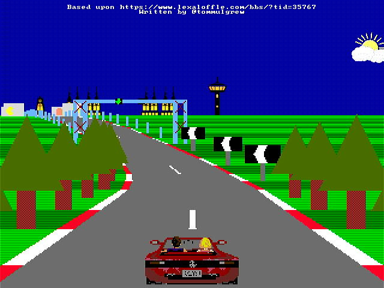
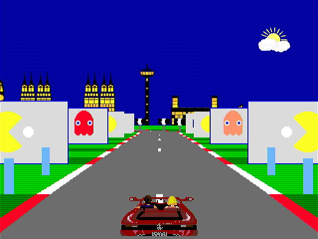
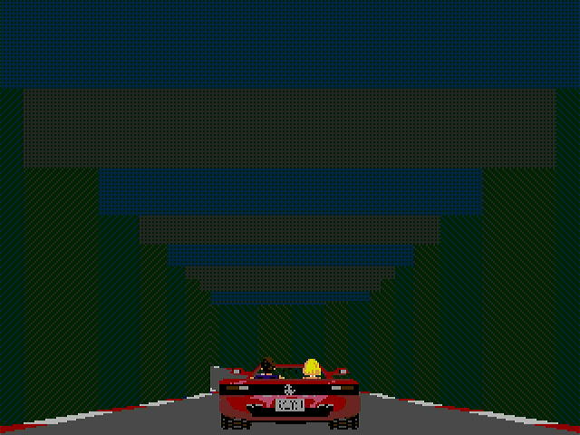

A full view of the cityscape backdrop (forced, not normally available), showing the background sprites.

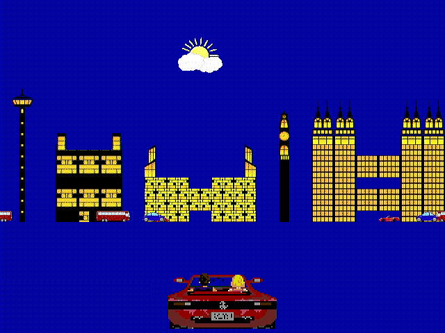

## PACMAN (GAMES)
A conversion of https://github.com/floooh/pacman.c to the PAWSv2 graphics, sound and input system.
<br>
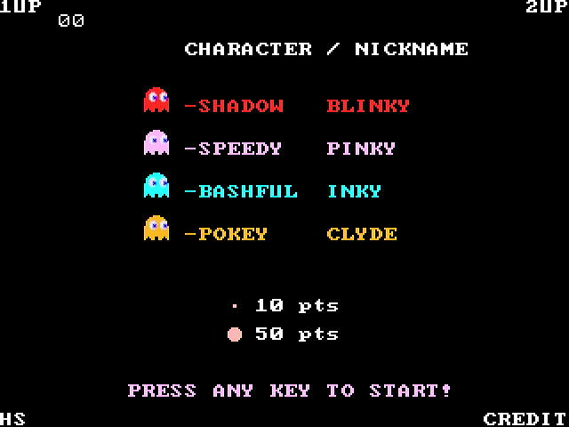
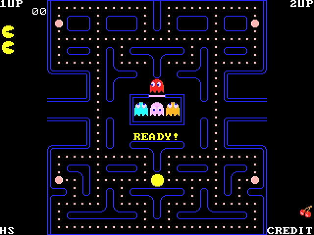

## RAYTRACE (DEMO)
A test of the floating-point unit. Runs first in 256 colours, then in 256 greys.
<br>
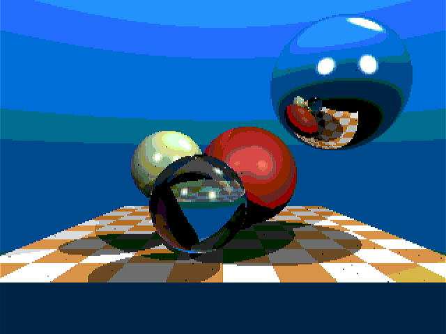
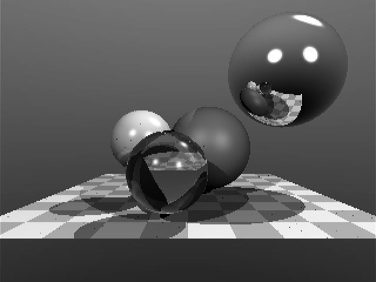

## SMURFS (DEMO)
A test of the dual bitmap display to provide the two parallel scrolling layers, transfer to the display by the DMA engine, extracting sections from the bitmap images in memory. The sky images are on the tilemaps. The Smurf theme is played in an SMT thread and uses a user-defined waveform (a 4 layer harmonic sine-wave). The smurf sprite uses the PAWSv2 library 32x32 sprites to combine 4 16x16 sprites, handling reflection and rotation.
<br>
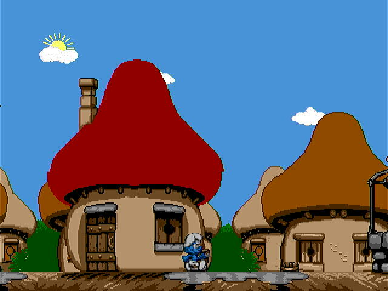
