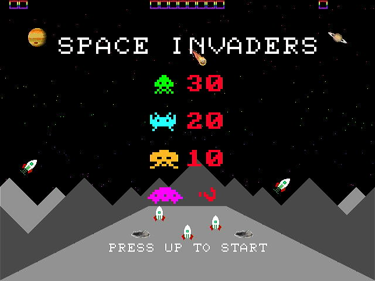

# PAWSv2 a Risc-V ( 32bit RV32IMAFC+B or 64bit RV64GC+B )

* Written in Silice
    * Inspired by ICE-V by [ICE-V](https://github.com/sylefeb/Silice/tree/master/projects/ice-v) by @sylefeb

Refer to RV32 for the 32bit CPU, or RV64 for the 64bit CPU. Development has stopped on the 32bit CPU, but is kept for reference.

Copy the files from the directory "SOFTWARE/PAWS" to an SDCARD and insert into the ULX3S. Flash the bitstream from "ULX3S/BUILD_ulx3s/PAWSv2-32.bit" or "ULX3S/BUILD_ulx3s/PAWSv2-64.bit" to the ULX3S

32bit software has a .PAW extension. 64bit software has a .P64 extension.

<br>
The 32-bit BIOS
<br>

```
fujprog PAWSv2-32.bit
```


<br>
The 64-bit BIOS
<br>

```
fujprog PAWSv2-64.bit
```


This will initialise the BIOS and allow the selection of a .PAW or .P64 file to load and run.

# Example Program Screenshots

## 3DMAZE (GAMES)
Based upon the ZX-81 3D MONSTER MAZE using PacMan Ghosts instead of the dinorsaur, as I don't have graphics for a Tyrannosaurus Rex.
<br>


## ASTROIDS (GAMES)
An implementation of the arcade games Asteroids, written from scratch, using the PAWSv2 sprites. The asteroids are moved in the SMT thread.
<br>


## DOOM (GAMES)
A conversion of https://github.com/mbitsnbites/mc1-doom to the PAWSv2 graphics, sound and input system. DOOM style PC speaker sound support was added to PAWSv2 for DOOM.
<br>


## IMGUI (DEMO)
A test running the IMGUI DEMO to check PAWSv2 against other people's code, specially heavy on the floating-point unit.
<br>


## INVADERS (GAMES)
An implementation of the arcade games Space Invaders. Written after reading http://nicktasios.nl/posts/space-invaders-from-scratch-part-1.html
<br>



## OUTRUN (DEMO)
An implementation of https://www.lexaloffle.com/bbs/?tid=35767 using the GPU and DrawList2D from the PAWSv2 library, and the floating-point unit. The car is a pixelblock sprite ported from http://www.dizionariovideogiochi.it/doku.php?id=out_run with no animation. The cityscape and clouds are drawn on the two tilemaps. There are vehicles running in front of the cityscape that are just visible in one frame of the demonstration using sprites. Press FIRE2 to exit.
<br>


## PACMAN (GAMES)
A conversion of https://github.com/floooh/pacman.c to the PAWSv2 graphics, sound and input system.
<br>


## RAYTRACE (DEMO)
A test of the floating point unit. Runs first in 256 colours, then in 256 greys.
<br>


## SMURFS (DEMO)
A test of the dual bitmap display to provide the two parallel scrolling layers, transfer to the display by the DMA engine, extracting sections from the bitmap images in memory. The sky images  The Smurf theme is played in an SMT thread and uses a user-defined waveform (a 4 layer harmonic sine-wave). The smurf sprite uses the PAWSv2 library 32x32 sprites to combine 4 16x16 sprites.
<br>

