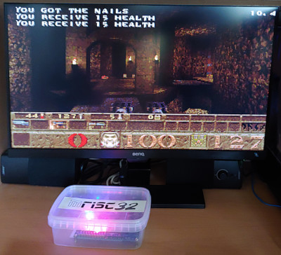

# MC1-Quake

This is the classic game Quake (by id Software) ported to the [MRISC32](https://mrisc32.bitsnbites.eu/)-based computer [MC1](https://github.com/mrisc32/mc1).



## Origins & License

MC1-Quake is based on the [original Quake v1.09 code base](https://github.com/id-Software/Quake) from 1997, with some bugfixes and alterations to make it work on MRISC32, and of course graphics and I/O routines for the MC1 computer.

Original [readme.txt](readme.txt).

The source code is released under the GNU General Public License, as outlined in [gnu.txt](gnu.txt).

## Building for MC1

In order to build MC1-Quake for an MC1 target, you need the MRISC32 GNU
toolchain installed. You can find it [here](https://github.com/mrisc32/mrisc32-gnu-toolchain).

```bash
$ mkdir WinQuake/out
$ cd WinQuake/out
$ cmake -G Ninja -DCMAKE_TOOLCHAIN_FILE=../mc1-toolchain.cmake -DCMAKE_BUILD_TYPE=Release ..
$ ninja
```

The resulting ELF binary is `WinQuake/out/mc1quake`, which is runnable in the [MRISC32 simulator](https://github.com/mrisc32/mrisc32-simulator) (use `run.sh` or `run.bat` to run it).

To build for an MC1 computer target, install the [MC1 SDK](https://github.com/mrisc32/mc1-sdk) and add `-DMC1SDK_HOME=/path/to/mc1-sdk-installation` to the CMake options.

## Building for other platforms

For testing purposes, you can also build MC1-Quake for other platforms, such as Linux.

To install dependencies on Ubuntu:

```bash
$ sudo apt install libsdl2-dev
```

To build:

```bash
$ mkdir src/out-host
$ cd src/out-host
$ cmake -G Ninja -DCMAKE_BUILD_TYPE=Debug ..
$ ninja
```

## Game data

To run Quake you need the game data. Search the internetz for *Quake Shareware V1.09* to get hold of the shareware version of Quake that includes the necessary game data.

`mc1quake` will search for an `id1` folder in the current working directory (i.e. the folder from which the program is started).
